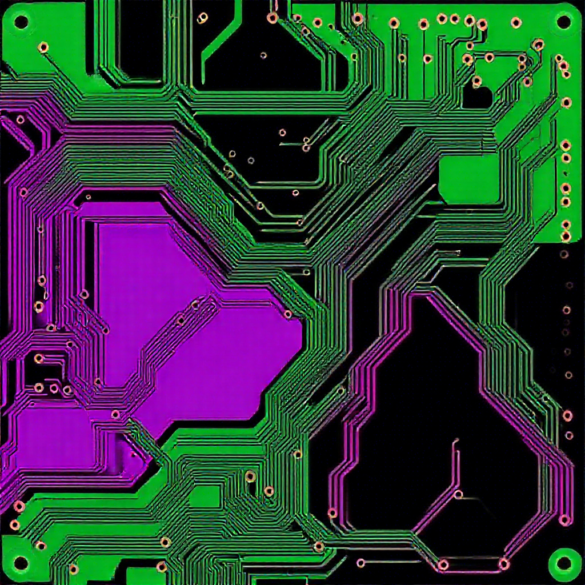
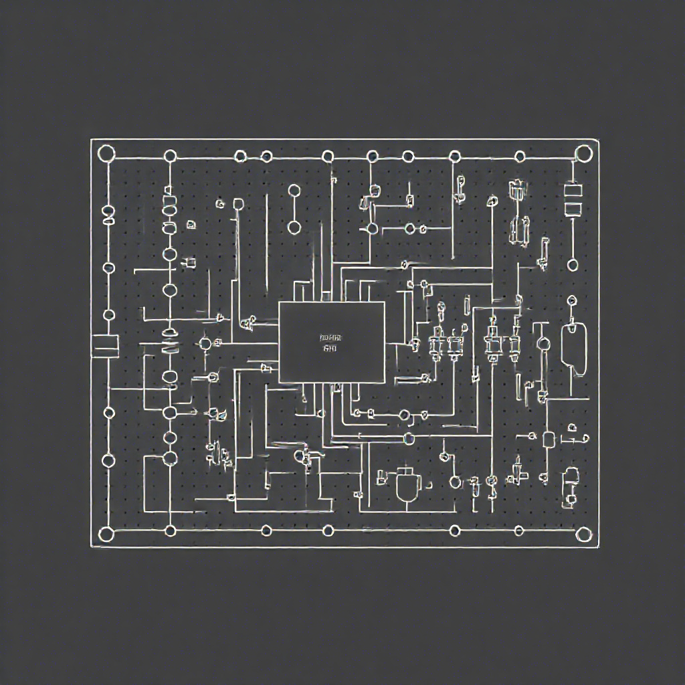

# Services

## Design Services
I provide comprehensive hardware consulting services, covering every stage from system-level design and circuit design (both analog and digital) to simulation, PCB design, documentation, board bring-up, and firmware development. My expertise ensures that each project, whether for industrial drones or pro audio applications, is executed with precision and technical excellence.

Additionally, I offer hardware design reviews and mentoring to support and enhance your design processes.

Areas of Expertise:

 - High-Speed, Mixed-Signal Electronics: Specializing in high-performance electronics for industrial drones and professional audio systems.

If you're interested in collaborating, please reach out via the [Contact](../contact/contact.md) page.

### PCB Design

**My PCB design capabilities include:**

 - ECAD Tools: Proficient in Altium Designer, OrCAD/Allegro, and KiCad.
 - Comprehensive Design Services: From schematic capture and library creation to maintenance.
 - Complex, Multi-Layer PCBs: Experience with 12+ layer, HDI boards.
 - BGA Designs: Expertise in BGA with pitches down to 0.5mm.
 - High-Speed, Sensitive Designs: Specializing in RF, FPGA, DDR3, PCIe, USB3 designs.
 - EMC and Signal Integrity: Focused on minimizing noise and ensuring robust performance.
 - Mechanical and Layout Considerations: Including shielding, connector I/O layout, stack-up, and controlled impedance design.
 - Production and Sourcing: Handling production file generation, component sourcing, and communication with fabrication and assembly houses.

### Circuit Design

**My circuit design capabilities include:**

 - System-Level Design: Comprehensive requirements capture and system architecture.
 - Component Selection: Strategic part selection for optimal performance.
 - Analog and Digital Circuit Design: Expertise in power, audio, RF circuits, as well as MCU and FPGA/SoC designs.
 - Simulation and Testing: Utilizing advanced simulation tools and in-house testing facilities.

### Embedded Firmware

**My embedded firmware services include:**

 - Pin-Out Planning: Detailed pin-out strategies for MCUs, FPGAs, and SoCs.
 - Driver Development: Creating efficient drivers for a wide range of peripherals.
 - Board Bring-Up: Expertise in the initial stages of hardware verification.
 - Programming Languages: Proficient in C/C++, Rust, and Verilog.
